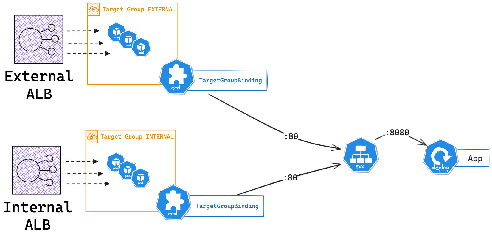
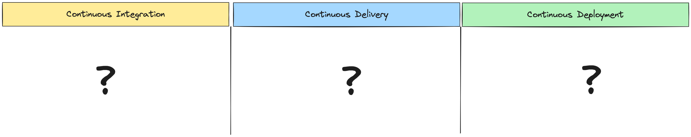
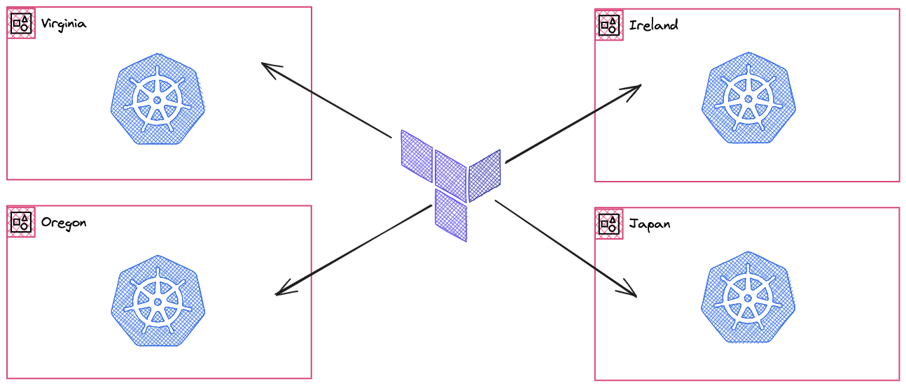

# DevOps Coding Challenge

> [!NOTE]
> This coding challenge aims to test the broad knowledge of a candidate ranging from Kubernetes to CICD and Terraform

## Requirements

* [ ] Git installed
* [ ] Docker installed

---
## Part 1 - Kubernetes

### :books: Introduction

The goal of this first section is to use an helm chart called [monochart](https://github.com/Lowess/helm-charts/tree/master/charts/monochart) to deploy an application.

> [!IMPORTANT]
> Please remind us what a Helm is chart ? What Helm charts are you familiar with ?

The concept of a [monochart](https://github.com/Lowess/helm-charts/tree/master/charts/monochart) is to offer an all purpose chart that can be used to solve multiple deployment needs. It greatly facilitates the maintenance of the code base since most, if not all applications, rely on this single chart.


### :pencil2: Exercise

Let's focus on getting an application deployed on Kubernetes using the [monochart](https://github.com/Lowess/helm-charts/tree/master/charts/monochart) mentioned above. Please note that the goal of the exercise is to figure out the `values.yaml` that will need to be used to meet the application requirements. You will simply use `helm template` command to render the chart with your proposed values (we won't deploy onto a real cluster).

This application needs to meet the following requirements (see diagram below):

* The application will be deployed under the `default` namespace
* The Helm release name will be `coding-challenge`
* The application (dockerfile) exposes port `8080`
* The service should be accessed over port `80`
* Pods should be attached to two distinct AWS target groups that belong to two ALBs

Useful links:
* Documentation to [AWS LoadBalancer Controller > TargetGroupBinding](https://kubernetes-sigs.github.io/aws-load-balancer-controller/v2.1/guide/targetgroupbinding/targetgroupbinding/)



> [!IMPORTANT]
> What is a custom resource definition (CRD) ? Can you identify the CRD in the diagram below ?

Open side by side:

* Your favorite code editor (VSCode / Sublime / others)
* Your terminal (you can use the terminal from your code editor)
  * Run the following command to start a container with all the proper tooling installed (Helm with all the needed plugins)

    ```sh
    docker run \
        -it --rm --entrypoint='' \
        -w /scratch \
        lowess/helm bash

    # Clone the helm-charts repository to work with monochart (we will use unittest from it)
    git clone https://github.com/Lowess/helm-charts

    # Go to monochart folder
    cd helm-charts/charts/monochart/

    # Create a values file named coding.yaml
    touch tests/hack/values/coding.yaml
    ```

> [!NOTE]
> Please note that a `Makefile` proposes useful command shortcuts to test your work. Run `make help` to check what is available. You will make sure that


> [!IMPORTANT]
> Write the appropriate helm values in coding.yaml to deploy the above application

---
## Part 2 - CI/CD

Let's pretend the application deployed in Part 1 is a Python application that has external dependencies listed in a `requirements.txt` file. The project is using [tox](https://tox.wiki/en/), a popular python automation framework that can be used to run unit tests.

* :pencil2: Use [https://excalidraw.com/](https://excalidraw.com/) and design a CI/CD pipeline for testing and deploying this application to Kubernetes



> [!IMPORTANT]
> What is a GitOps workflow ? What advantages does it bring over traditional Kubernetes deployment ?

---
## Part 3 - Infrastructure as Code with Terraform

Using your favorite infrastructure as code software knowledge (Terraform / Terragrunt or other) explain how you will organize your code repository to manage a multi-region deployment of your kubernetes clusters.

We will assume the following:

* We want a global presence in `Virginia` / `Oregon` / `Ireland` / `Japan`
* We will need to figure out how to bootstrap the cluster with `admin` charts (prometheus operator / log shipping / sealed secret / external DNS)



> [!IMPORTANT]
> What mechanisms or features do you use to keep your Terraform code DRY (Don't repeat yourself) ?
